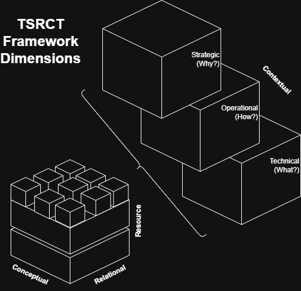
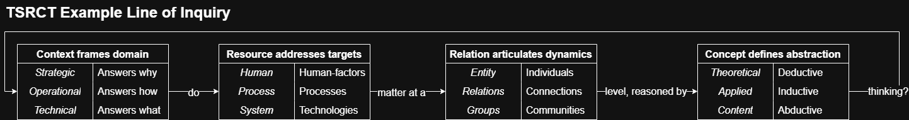

# Theoretical System Reasoning Conceptual Toolkit (TSRCT) 

## Abstract

The Theoretical System Reasoning Conceptual Toolkit (TSRCT) is a comprehensive framework designed to facilitate the exploration and understanding of organizational change in the context of AI adoption. Recognizing the complex interplay of factors driving successful integration of AI technologies, TSRCT is structured around four critical dimensions: Contextual, Resource, Relational, and Conceptual. TSRCT offers a multi-dimensional perspective, equipping consultants and decision-makers with a structured approach to navigate the nuanced challenges of AI integration. By providing holistic context around resouce-informed relational dynamics at varying levels of abstraction, the framework aids organizations in crafting more informed and effective AI partnering. The framework empowers organizations to generate tailored lines of inquiry, facilitating critical analysis of their unique implications and sociotechnical challenges. By coordinating the interrogation of strategic motivations (why), operational methods (how), and technical implementations (what), TSRCT serves as a catalyst for positive outcomes, guiding organizations to optimize AI adoption while fostering innovation, resilience, and sustainable growth.

## TSRCT Dimensions

The following diagram outlines the 4 'conceptually orthogonal' dimensions of the TSRCT framework (i.e., Contextual, Resource, Relational, Conceptual), illustrating a fractal hypercube based on the interconnections of those dimensions:

## TSRCT Elements

Creating questions based on unique groupings of the individual elements from the TSRCT framework allows users to explore the interplay between different aspects of organizational change and AI adoption. Below is an example matrix outlining the unique combinations across all elements:

Combining these elements across their respective dimensions enables devlopment of bespoke lines of inquiry based on the specific AI use case or collection of capabilities. For example, applying TSRCT dimensions/elements to address organizational relevance of AI technologies (i.e., "why does it matter?") could result in the following lines of inquiry:

