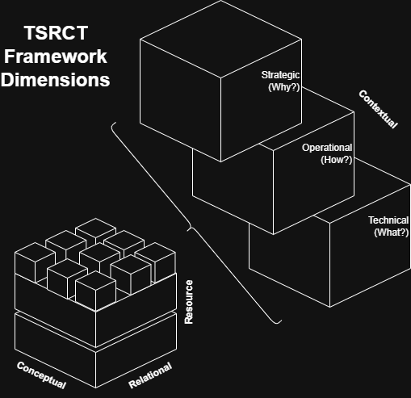
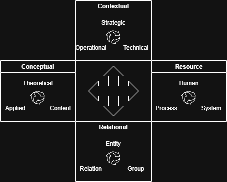
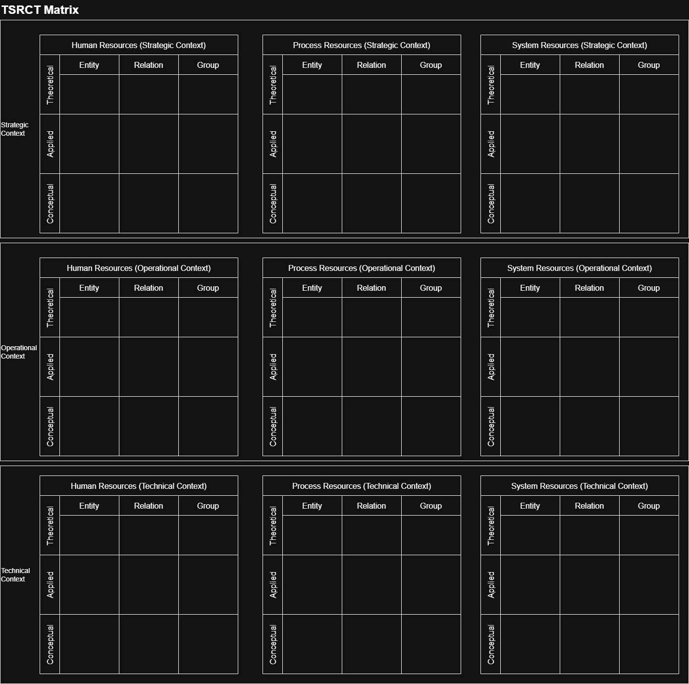
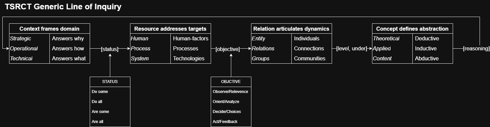
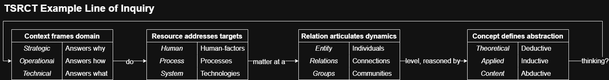

# Theoretic System Reasoning Conceptual Toolkit (TSRCT) 
## A Framework for AI Integration

---
### Executive Summary

This white paper is a living document detailing the Theoretic System Reasoning Conceptual Toolkit (TSRCT), a comprehensive framework designed to guide organizations through the complexities of AI adoption. By addressing four critical dimensions (Contextual, Resource, Relational, and Conceptual) TSRCT provides a holistic approach to integrating AI technologies effectively. The framework aims to streamline strategic alignment, optimize resources, enhance relational dynamics, and reconcile diverse theoretical and practical aspects of AI adoption. TSRCT empowers organizations to navigate the nuanced challenges of evolving AI paradigms, ultimately enhancing competitiveness and fostering innovation.

### Introduction

Rapid evolutions in artificial intelligence capabilities (e.g., classical deep learning to foundation and frontier models) have transformed industries, offering unprecedented opportunities for innovation. However, integrating AI into existing organizational structures presents significant challenges, from sociotechnical hurdles to strategic misalignments. This white paper outlines the TSRCT framework, developed to facilitate AI integration. By exploring the context-specific requirements and dynamics of AI adoption, TSRCT serves as a vital tool for organizations looking to leverage AI's transformative potential while maintaining operational coherence and vision alignment.

### TSRCT Framework Overview

The TSRCT framework establishes a structured pathway for organizational change in the face of AI integration. It is constructed around four interdependent dimensions: Contextual, Resource, Relational, and Conceptual. Each dimension consists of specific elements that address strategic, operational, technical, human, procedural, systemic, inter-entity relations, and content-related aspects of AI incorporation. This holistic approach ensures that every facet of organizational transformation is considered, facilitating a comprehensive strategy for successful AI deployment.

Each dimension is designed to be 'conceptually orthogonal' to address the unique, yet interconnected elements within. The framework is modular at its core, intended to guide consulting and inquiry (rather than a "one size fits all" solution for AI adoption). Illustrated below, the framework can be represented as a fractal hypercube (i.e. tesseract) with the dimensions forming the basis for this representation:

The 4 TSRCT dimensions each contain 3 distinct elements designed to address a core consideration of a given dimension. Elements represent the most granular, distinct considerations of the framework. They are designed to be used individually, in tandem, or in the aggregate based on an organization's specific AI-related objectives (i.e., elements may be consolidated or ignored as necessary). The following diagram represents TSRCT's elements within their respective dimensions:

#### 1. Contextual Dimension

The Contextual dimension frames the line of inquiry by specifying the domain of interest when addressing challenges around AI adoption and innovation. This dimension explores the strategic, operational, and technical questions organizations face during AI adoption, focusing on aligning AI initiatives within the broader organizational context.

**Contextual Elements:**

- **Strategic:** Focuses on the overarching goals and motivations behind adopting AI and driving organizational change. Defines the strategic objectives of AI adoption and how they align with the organization's overall mission and goals. Considers implications on competitive advantage, positioning/adoption, and long-term vision. *Answers why*.

- **Operational:** Methods and approaches to examine the operational changes needed to support AI implementation, including infrastructure, workflows, and process integration. Evaluates existing operations to be optimized or transformed through AI. *Answers how*.

- **Technical:** Considers the specific technologies and tools that are being adopted or considered for adoption. Outlines the technical requirements and competencies needed for AI integration. Address issues like data management, algorithm selection, and technology stack compatibility for a specific AI use case. *Answers what*.

#### 2. Resource Dimension

The Resource dimension identifies the target objects and systems related to holistic AI innovation. This dimension emphasizes the human, procedural, and technological resources necessary for AI adoption.

**Resource Elements:**

- **Human:** Involves the workforce, including skills, roles, and the human elements involved in AI adoption. Assess the skill sets required for AI deployment, including hiring needs, training programs, and change management efforts to build a workforce capable of leveraging AI technologies. *Addresses people*.

- **Process:** Encompasses the procedures and workflows that are being transformed or enhanced through AI. Leverages methodologies and processes for AI project management, including agile practices, feedback loops, and iteration strategies that facilitate smooth AI integration. *Addresses organizational processes*.

- **System:** Refers to the technological infrastructure and systems that support AI implementation. Considers the organization’s broader system, including logistical resources, IT infrastructure, and regulatory considerations. Identifies hardware and software system requirements to support AI initiatives sustainably. *Addresses technological systems*.

#### 3. Relational Dimension

The Relational dimension articulates dynamics of AI adoption at individual- and community-level, including their interconnections. This dimension involves analyzing these dynamics in terms of entities, relationships, and groups within and outside the organization.

**Relational Elements:**

- **Entity:** Focuses on the individual units or components within the organization that interact with AI initiatives. Evaluates the roles and responsibilities of various stakeholders involved in AI adoption, examining how to transform these roles with AI capabilities. *Examines components at the individual-level*.

- **Relation:** Explores the interactions and connections between entities to include teams, departments, or systems, in the context of AI adoption. Analyze how AI affects intra- and inter-organizational relationships, including collaboration, communication, and decision-making processes. *Examines connections between individuals and groups*.

- **Group:** Explores the impact of AI on team structures and dynamics. Considers resistance, acceptance, and empowerment factors that influence team interactions through examining collective dynamics and collaborations that occur across larger organizational or network structures. *Examines community and inter-community relationships*.

#### 4. Conceptual Dimension

The Conceptual dimension defines the level of abstraction when considering the implication of AI capabilities. This dimension focuses on reconciling theoretical, applied, and content-related aspects of AI adoption.

**Conceptual Elements:**

- **Theoretical:** Concerns the underlying theories, models, and frameworks that inform the approach to AI adoption and organizational change. Establishes a theoretical foundation that supports understanding the implications of AI technologies, including logistical considerations, governance frameworks, and societal impact. *Involves deductive thinking*.

- **Applied:** Focuses on the practical application and implementation of theoretical concepts in real-world scenarios. Identifies best practices and case studies that illustrate successful AI integration. Develops guidelines and toolkits to assist organizations in practical application of AI objectives given emergent trends and capabilities. *Involves inductive thinking*.

- **Content:** Pertains to the specific data, knowledge, and information that drive AI use case development and utilization. Generates specific insights that address mission-specific challenges and opportunities of AI adoption, recognizing the unique needs and constraints of specific AI-enabled capabilities. *Involves abductive thinking*.

### Implementation Approaches 🚧

Effective implementation of the TSRCT framework involves customization to align with specific organizational needs. This strategy emphasizes the importance of cross-functional teams to drive AI initiatives, continuous learning through feedback loops, and establishing clear metrics for monitoring and evaluation. By iteratively refining AI strategies, organizations can realize greater value from AI investments.

The framework can be applied under a variety of scenarios, including (but not limited to):
* Developing bespoke lines of inquiry using unique combinations of elements (illustrated as a case study)
* Investigating the interconnections within dimensions (e.g., Human-Process-Technology relationships within the Resource dimension)
* Defining and addressing organizational outcomes around AI adoption at the appropriate level of detail and abstraction

TSRCT serves as a means (rather than singular end-state) to articulate organizational outcomes, approaches, and requirements for AI adoption. As such, the framework's dimensions/elements are designed to function as optional considerations to be reconciled (or even ignored) as appropriate for a use case or capability. How an organization chooses to define and interpret the specific elements shapes TSRCT's implementation approaches.

Shown below, the framework elements can be organized into a matrix to identify areas of interest to begin considering organizational goals for utilizing TSRCT:

### Case Study: Example Lines of Inquiry 🚧

To illustrate the framework's impact, this section presents a case study in applying TSRCT elements. This example provide practical insights into overcoming common AI adoption challenges and highlight measurable outcomes achieved through strategic integration. The goal of this exercise is to develop bespoke lines of inquiry from unique groupings of framework elements to articulate the relevance of AI to organizational change.

The use case considers dimensions and elements grouped and defined by the illustration below. This provides a formula for generating lines of inquiry based on the specific status, objectives, and appropriate level of abstraction.

For the purposes of the case study, we identify a line of inquiry with the objective of understanding AI relevance for an organization. Examining the status of framework resources under this objective allows for development of specific considerations in AI adoption and innovation.

Utilizing the above element definitions, the flowchart assists in developing the following example lines of inquiry:
* Why does human capital matter on an individual basis when thinking deductively (i.e. programmatically)?
* Why (and to what extent) should we invest in technical infrastructure to keep pace with relevant emergent AI trends?
* How do we analyze interconnected processes in an applied/inductive (i.e. probabilistic) capacity?
* How are teams collaborating and interfacing with AI technologies? How can this be reliably monitored and secured?
* What are necessary processes to ensure transparency and auditability of a given collection of AI capabilities?
* What are the technological decision points that enable abductive (i.e. heuristic) understanding around a capability?

These lines of inquiry foster discussion and analysis when considering a given AI capability. They can result in SMART problem statements (i.e. specific, measurable, achievable, relevant, time-bound), hypothesis testing, or identification of necessary refinement/restatement of a line of inquiry.

### Conclusion 🚧

To summarize, the TSRCT framework offers a pathway for organizations to navigate the complex landscape of AI adoption. By addressing interconnections between context, resource, relations, and concepts, the framework facilitates comprehensive organizational transformation. As the AI landscape continues to evolve, the TSRCT framework provides a robust foundation for innovation and competitive advantage.

### Resources 🚧

* [The Institutional Levels of War](https://thestrategybridge.org/the-bridge/2016/5/5/the-institutional-level-of-war)
* [The Golden Circle](https://simonsinek.com/golden-circle/)
* [People, Process, Technology](https://www.smartsheet.com/content/people-process-technology)
* [Entity Relation Model](https://dl.acm.org/doi/pdf/10.1145/320434.320440)
* [Types of Inference](https://human.libretexts.org/Bookshelves/Philosophy/Introduction_to_Philosophy_(OpenStax)/05%3A_Logic_and_Reasoning/5.04%3A_Types_of_Interference)

### Appendices 🚧

(TO-DO) This section will include additional information, templates, and workflows to support applications of the TSRCT framework. A glossary of key terms will also be provided to clarify technical jargon and concepts.

### Contact Information 🚧

For further inquiries or discussions regarding the TSRCT framework contact @alexwalterhiggins.

---
