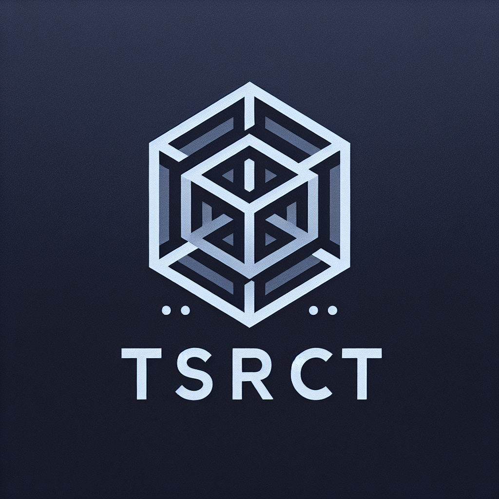

# Theoretical Systematic Reasoning Conceptual Toolkit (TSRCT) 
## A Framework for AI Adoption

---
### Executive Summary

This white paper introduces the Theoretical Systematic Reasoning Conceptual Toolkit (TSRCT), a comprehensive framework designed to guide organizations through the complexities of AI adoption. By addressing four critical dimensions (Contextual, Resource, Relational, and Conceptual) TSRCT provides a holistic approach to integrating AI technologies effectively. The framework aims to streamline strategic alignment, optimize resources, enhance relational dynamics, and reconcile diverse theoretical and practical aspects of AI adoption. TSRCT empowers organizations to navigate the nuanced challenges of evolving AI paradigms, ultimately enhancing competitiveness and fostering innovation.

### Introduction

The rapid advancement of artificial intelligence has transformed industries, offering unprecedented opportunities for innovation. However, integrating AI into existing organizational structures presents significant challenges, from technical hurdles to strategic misalignments. This white paper outlines the TSRCT framework, crafted to facilitate seamless AI integration. By exploring the context-specific requirements and dynamics of AI adoption, TSRCT serves as a vital tool for organizations looking to leverage AI's transformative potential while maintaining operational coherence and vision alignment.

### TSRCT Framework Overview

The TSRCT framework establishes a structured pathway for organizational change in the face of AI integration. It is constructed around four interdependent dimensions: Contextual, Resource, Relational, and Conceptual. Each dimension consists of specific elements that address strategic, operational, technical, human, procedural, systemic, inter-entity relations, and content-related aspects of AI incorporation. This holistic approach ensures that every facet of organizational transformation is considered, facilitating a comprehensive strategy for successful AI deployment.

### 1. Contextual Dimension

The Contextual dimension frames the line of inquiry by specifying the domain of interest when addressing challenges around AI adoption and innovation. This dimension explores the strategic, operational, and technical questions organizations face during AI adoption, focusing on aligning AI initiatives with the broader organizational context.

**Contextual Elements:**

- **Strategic:** Focuses on the overarching goals and motivations behind adopting AI and driving organizational change. Defines the strategic objectives of AI adoption and how they align with the organization's overall mission and goals. Considers implications on competitive advantage, positioning/adoption, and long-term vision. *Answers why*.

- **Operational:** Methods and apraoches to examine the operational changes needed to support AI implementation, including infrastructure, workflows, and process integration. Evaluates existing operations to be optimized or transformed through AI. *Answers how*.

- **Technical:** Considers the specific technologies and tools that are being adopted or considered for adoption. Outlines the technical requirements and competencies needed for AI integration. Address issues like data management, algorithm selection, and technology stack compatibility for a specific AI use case. *Answers what*.

### 2. Resource Dimension

The Resource dimension identifies the target objects and systems related to holistic AI innovation. This dimension emphasizes the human, procedural, and technological resources necessary for AI adoption.

**Resource Elements:**

- **Human:** Involves the workforce, including skills, roles, and the human elements involved in AI adoption. Assess the skill sets required for AI deployment, including hiring needs, training programs, and change management efforts to build a workforce capable of leveraging AI technologies.

- **Proccess:** Encompasses the procedures and workflows that are being transformed or enhanced through AI. Leverages methodologies and processes for AI project management, including agile practices, feedback loops, and iteration strategies that facilitate smooth AI integration.

- **System:** Refers to the technological infrastructure and systems that support AI implementation. Considers the organization’s broader system, including financial resources, IT infrastructure, and regulatory considerations. Identify investments required to support AI initiatives sustainably.

### 3. Relational Dimension

The Relational dimension articulates dynamics of AI adoption at individual- and community-level, including their interconnections. This dimension involves analyzing these dynamics of in terms of entities, relationships, and groups within and outside the organization.

**Relational Elements:**

- **Entity:** Focuses on the individual units or components within the organization that interact with AI initiatives. Evaluates the roles and responsibilities of various stakeholders involved in AI adoption, examining how to transform these roles with AI capabilities.

- **Relationship:** Explores the interactions and connections between different entities, such as teams, departments, or systems, in the context of AI adoption. Analyze how AI affects intra- and inter-organizational relationships, including collaboration, communication, and decision-making processes.

- **Group:** Explores the impact of AI on team structures and dynamics. Considers resistance, acceptance, and empowerment factors that influence team interactions through examining collective dynamics and collaborations that occur across larger organizational or network structures.

### 4. Conceptual Dimension

The Conceptual dimension defines the level of abstraction when considering the implication of AI capabilities. This dimension focuses on reconciling theoretical, applied, and content-related aspects of AI adoption.

**Conceptual Elements:**

- **Theoretical:** Concerns the underlying theories, models, and frameworks that inform the approach to AI adoption and organizational change. Establishes a theoretical foundation that supports understanding the implications of AI technologies, including logistical considerations, governance frameworks, and societal impact. *Involves deductive thinking*.

- **Applied:** Focuses on the practical application and implementation of theoretical concepts in real-world scenarios. Identifies best practices and case studies that illustrate successful AI integration. Develops guidelines and toolkits to assist organizations in practical application of AI strategies. *Involves inductive thinkng*.

- **Content:** Pertains to the specific knowledge, data, and information that drive AI development and utilization. Geneartes specific insights that address mission-specific challenges and opportunities of AI adoption, recognizing the unique needs and contexts of various sectors. *Involves abductive thinking*.

### Implementation Approaches (TO-DO)

Effective implementation of the TSRCT framework involves customization to align with specific organizational needs. This strategy emphasizes the importance of cross-functional teams to drive AI initiatives, continuous learning through feedback loops, and establishing clear metrics for monitoring and evaluation. By iteratively refining AI strategies, organizations can realize greater value from AI investments.

### Case Studies: Example Lines of Iniqury (TO-DO)

To illustrate the framework's impact, this section presents case studies of hypothetical organizations interested in applying TSRCT elements. These examples provide practical insights into overcoming common AI adoption challenges and highlight measurable outcomes achieved through strategic integration.

### Conclusion

To summarize, the TSRCT framework offers a pathway for organizations to navigate the complex landscape of AI adoption. By addressing interconnections between context, resource, relations, and concepts, the framework facilitates comprehensive organizational transformation. As the AI landscape continues to evolve, the TSRCT framework provides a robust foundation for innovation and competitive advantage.

### References (TO-DO)

All sources, research, and previous works referenced in the white paper are listed here, ensuring thorough documentation of the framework's conceptual and empirical foundations.

### Appendices (TO-DO)

This section includes additional data, visual aids, and detailed explanations to support the content discussed in the main sections. A glossary of key terms is also provided to clarify technical jargon and concepts.

### Contact Information (TO-DO)

For further inquiries or discussions regarding the TSRCT framework, contact details of the authors and contributing organizations are provided here.

---
